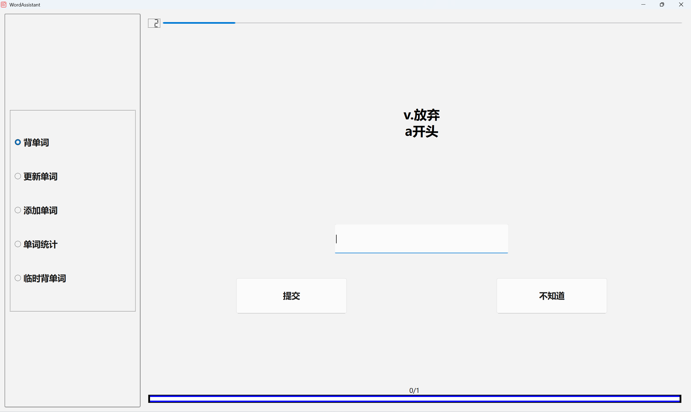
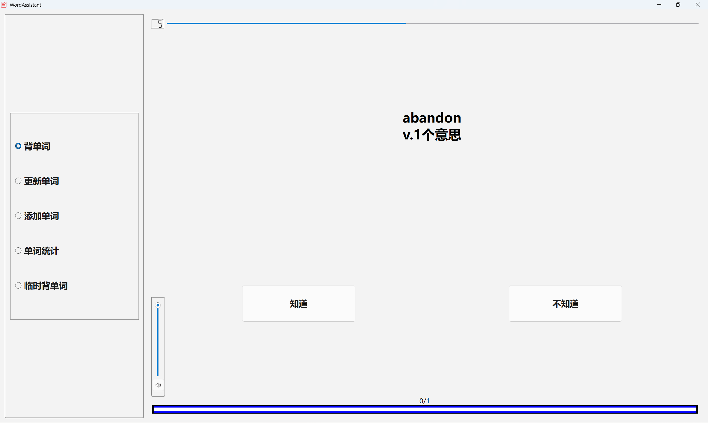
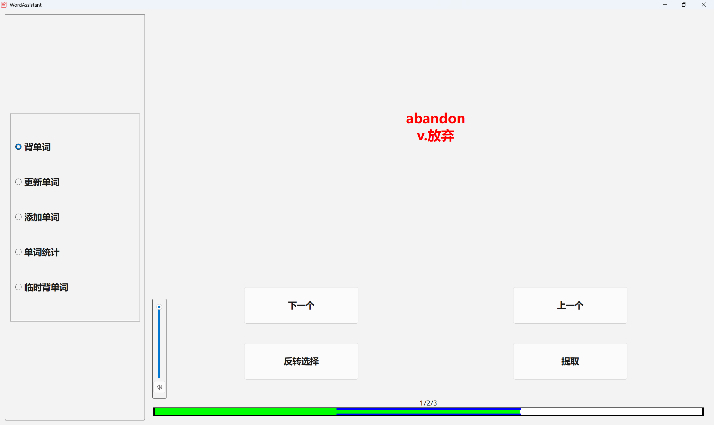
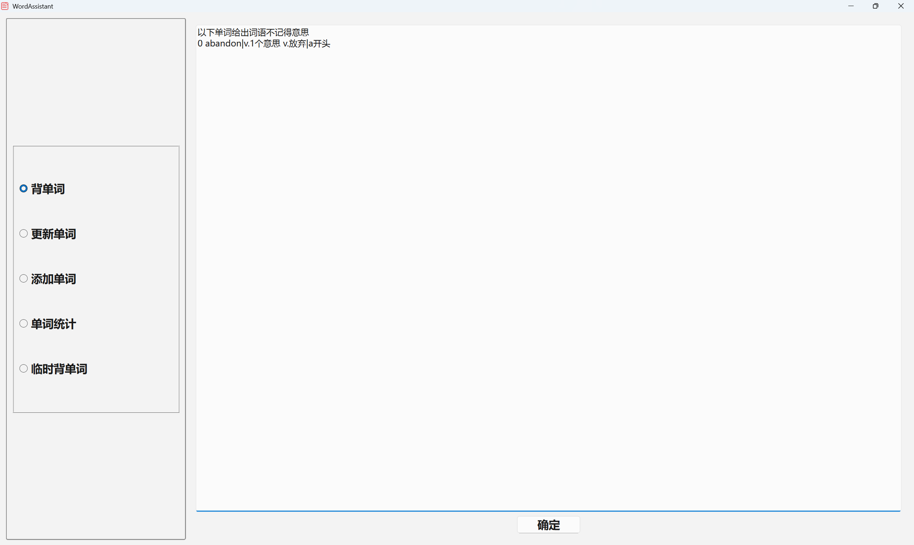

# WordAssitant

WordAssitant 是用于记忆单词的软件，基于 C++ QT 5.15.2 Visual Studio 构建。

## 主界面


## 背单词





每次背单词时，程序会从词库中抽取最多 200 个需要背诵的单词，随机排序并选择是显示中文还是英文，然后逐个显示以供回答。

当显示英文时，只有 `知道` 和 `不知道` 两个选项；当显示中文时，会需要你输入对应的英文（你也可以选择 `不知道`），你的输入告诉程序你是否认识该单词，并决定了程序后续的行为。

由于一个单词的单词构成确定，但意思构成不确定，故不要求输入准确的意思，而仅凭自身回忆确认，是否 `知道` 该单词的意思。

在中英文下方，还有对应的提示，可以用于解决一词多义的情况。上方计时器限制了回答的时间，单词和意思越复杂总时间越长。下方有总单词个数进度条，可以告知背诵进程。当显示英文时，左下角会有声音按钮，可以调节音量，按下按钮或 `Ctrl + P` 会播放该单词读音，显示单词时也会自动播放。 读音使用网易云的 API。

当选择某个选项后，该单词完全展示



`反转选择` 选项用于反转正确和错误，以防误判；`提取` 选项将单词从词表中抽取出来，以便更改其中的错误。

当输入英文有误，完全展示的界面也会显示你的输入，以便观察输入的差别。

通过 `PgUp` 和 `PgDown`，你可以滑动进度条，进入以前单词的完全展示界面，同样支持声音播放和选择提取等功能。

当背诵结束后，会显示提取的单词以及错误的单词



你可以在一天内重复点击背单词以多次背诵，但是

- 一天最多背诵 300 个单词，该值可以在配置文件中配置
- 只有还有需要背诵的单词，才能进行背诵

你也可以在单词统计中查看可背单词数量等统计信息。

判断一个单词是否需要背诵，取决于其连续回答正确的次数和上次背诵的时间。未回答正确的单词在当天立即需要背诵，而正确一次的单词允许在一天后；两次的单词允许在两天后背诵。这些间隔时间也可以进行配置。当程序发现需要背诵单词数量多于 300 个时，会抽取超过间隔时间最长的单词。每次背单词时时间会自动更新，你也可以通过`更新单词`手动更新。

中英文的连续正确次数是分别计算的。

## 添加单词

你可以在添加单词界面添加单词：

例如
```
abandon|v.1个意思 v.放弃|a开头
abandon v.放弃|a开头
abandon|v.1个意思 v.放弃
abandon v.放弃
```

英文和中文之间以空格分割，如果需要，可以用 `|` 字符在中英文后面附加注释，于中/英文一起显示。

同时还支持内部格式的输入

```
1 2 3 4 abandon|v.1个意思 v.放弃|a开头
```

四个数字代表

- 英文距离上次背诵的时间
- 中文距离上次背诵的时间
- 英文的连续正确次数
- 中文的连续正确次数

输入重复的单词或格式错误的单词会导致重复单词/错误单词被提取并显示。


## 临时背单词

临时背单词会要求你输入单词，并以正常流程进行背诵。这些单词不会被输入词库。

## 日志

一般来说，任何误操作都会导致临时数据被保存到程序同目录日志中，从而无需担心数据丢失。